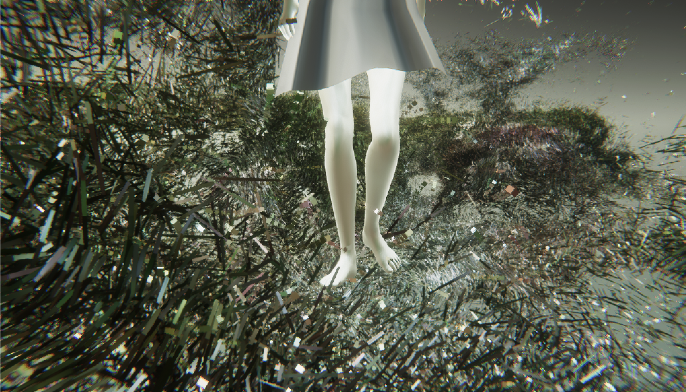
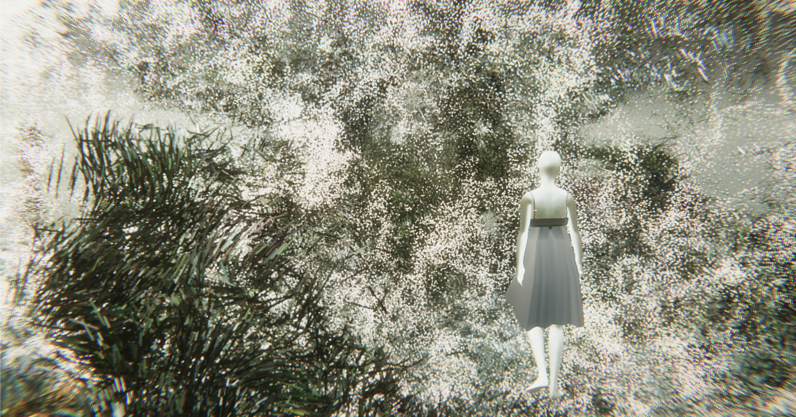
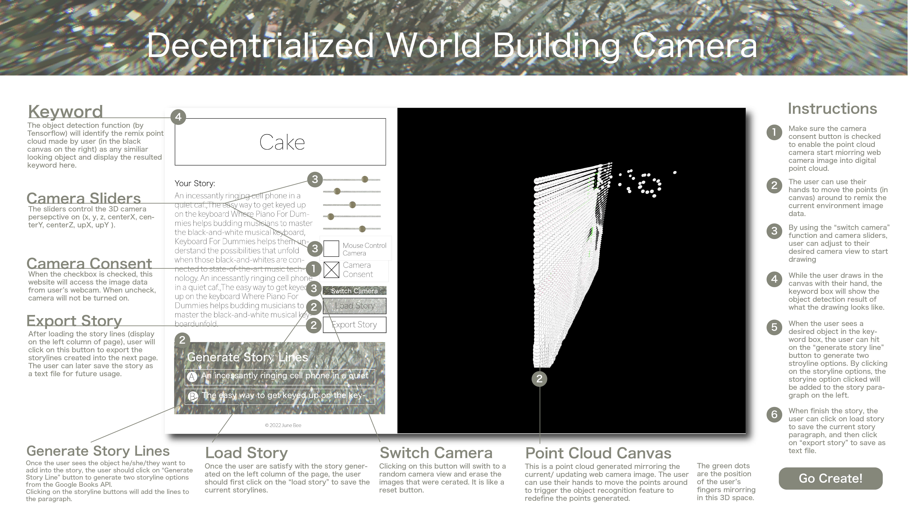
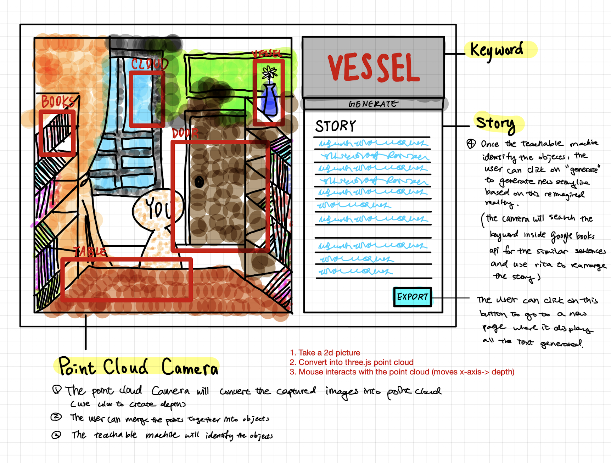
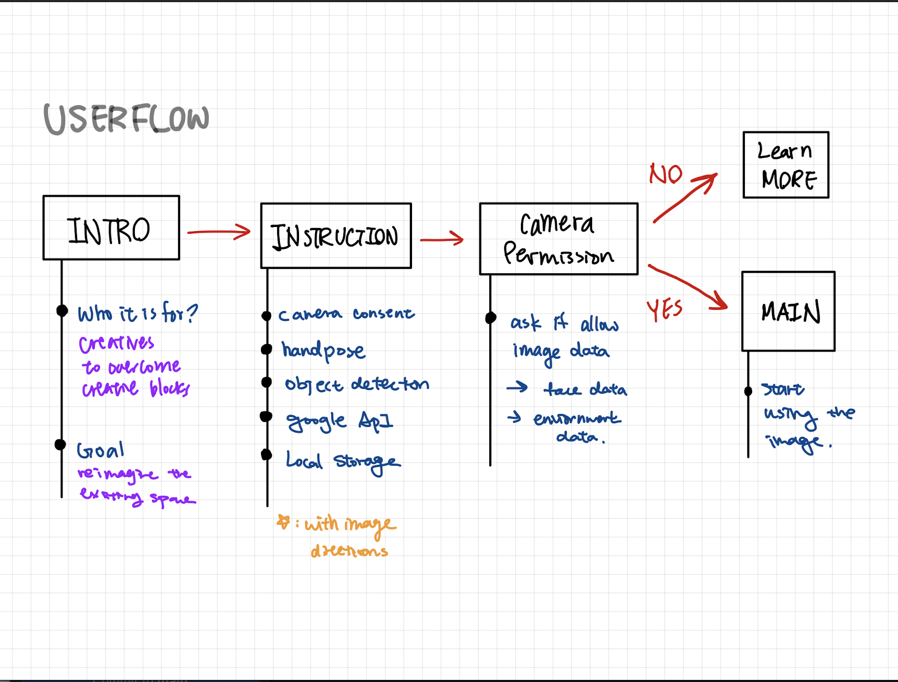

# ✺✺✺POITORY✺✺✺
<!-- 1-2 sentence description of assignment. Nice to include a screenshot or .gif of the site in action. -->

This is an online tool for the 21st century mixed media creatives (artists, designers, writers, and more types of creator) to resolve their creativity blocks by reimagining and remixing their current space and time. As creatives, we have always imagine the world going forward with a new vision, but how do we break the habit of looking to the front and start by applying the same vision to the present in order to bridge our way to reach that ultimate future? Stories, stories are the answer.

**Click here for...**

>[💻 Website](https://junebee66.github.io/AR-Point-Cloud-World-Building-Camera/)  
[⏯ Video Demo](https://youtu.be/gyd9dNDEOlQ) 
[🎥 Concept Video](https://youtu.be/0F6T9y7oQ-8)

## **🫱 How to Use?**

### **🛑 DISCLAIMER 🛑**
This project is still in progress stage. Most functions work, but it might take up to 30 second to 1 minute to load in the very beginning for the handpose, object detection, and 3D camera library. Thank you for your patience!

### **⭐️ Website Functionality**
>This camera converts the captured video from the user’s webcam into 3D point clouds. The user can interact (pushing/pulling) the points to create new meshes. As the user is creating, the camera will continuously scan the mesh user created to try to recognize what object it visually looks like. The detected object name will be searched into Google Books API and start generating new storyline. The final story paragraph can later be exported as .txt file for user's future usage. 

**1️⃣ Camera Settings**
> Make sure the camera consent button is checked to enable the point cloud camera start miorring web camera image into digital point cloud.

**2️⃣ Remix Point Cloud**
> The user can use their hands to move the points (in canvas) around to remix the current environment image data.

**3️⃣ Drawing Angle**
> By using the “switch camera” function and camera sliders, user can adjust to their desired camera view to start drawing

**4️⃣ Story Keywords**
> While the user draws in the canvas with their hand, the keyword box will show the object detection result of what the drawing looks like.

**5️⃣ Generate Storylines**
> When the user sees a desired object in the keyword box, the user can hit on the “generate story line” button to generate two stroyline options. By clicking on the storyline options, the storyine option clicked will be added to the story paragraph on the left. 

**6️⃣ Exporting Story**
>When finish the story, the user can click on load story to save the current story paragraph, and then click on “export story” to save as text file.

## **💡About**

#### **⭐️ Point Cloud Canvas**
_-Still in developing stage-_

>This is a point cloud generated mirroring the current/ updating web camera image. The user can use their hands to move the points around to trigger the object recognition feature to redefine the points generated. 

>The green dots are the position of the user’s fingers mirorring in this 3D space.

#### **⭐️ Keyword Box**
>The object detection function (by Tensorflow) will identify the remix point cloud made by user (in the black canvas on the right) as any similiar looking object and display the resulted keyword here. 

#### **⭐️ Character Descriptions**
>This is an overview description of the journey the Bible character you are matched up with has gone through. This gives the user a rough idea of why he/she/they’s input is matched/similiar to the Bible character’s journey.

#### **⭐️ Switch Camera**
>Clicking on this button will swith to a random camera view and erase the images that were cerated. It is like a reset button.

## **✍🏻Process & Documentation**

**1. Matching Algorithm**

For this project, I wrote an algorithm to analyze the sentence structure of user's input and match it with the part of speech sentence pattern with Bible characters descriptions, using [Rita.js](https://rednoise.org/rita/) library. 

I first saperate bible verse and input text into individual words

    
    RiTa.tokenize(abraham);

put them into their own array and analyze both their part of speech

     for (i = 0; i < tokens.length; i++){
        let inputPos = RiTa.pos(tokens[i]);
        inputArray.push(inputPos);

        }
     
     for (b = 0; b < abrahamText.length; b++){
        let abrahamPosF = RiTa.pos(abrahamText[b]);
        abrahamArray.push(abrahamPosF);
    }

Then match them through for loop to match the part of speech one by one (1a, 1b, 1c, 2a, 2b, 2c..etc)

    function matching(inputArray, bibleArray, counter){   
        counter = 0;
        if(inputArray.length < bibleArray.length){
            for( i = 0; i<inputArray.length; i++){
            for( b = 0; b<bibleArray.length; b++){
                if (inputArray[i][0] == bibleArray[b][0]){
                    counter++
                    // console.log(counter);
                };
            }
            }
        }else{
            console.log("user input is longer");
            for( i = 0; i<bibleArray.length; i++){
                for( b = 0; b<inputArray.length; b++){
                    if (inputArray[b][0] == bibleArray[i][0]){
                        counter--

                    };
                }
                }

        }
        console.log(bibleArray);
        return counter;
    }

Then compare which character has the most matching part of speech, that wil be the one disply on the website

    function compare(abrahamCount, mosesCount){

        if (abrahamCount > mosesCount){
            abrahamCharacter();
            console.log("abraham won!!");
        } else{
            mosesCharacter();
            console.log("moses won!");
        }
        console.log("moses count:" + mosesCount);
        console.log("abraham count:" + abrahamCount);

    }
    

2. Bible API

I created a json file to store two characters information for this prototyping pruposes. In the future, I will use an online Bible API to get the full texts in the actual Bible.

3. Generative Drawings

I didn't entirely finish this part, but so far there is a drawing created using p5 library. The drawing speed and color is based on user's matching percentage with the bible character.

## **🛑Challenges & Struggles**

<!-- What challenges and struggles did you face? -->
The two biggest problem I faced is to: 

- come up with a reasonable way to match the user's input with bible stories
- generate meaningful visuals based on input value

I spent almost 8 hrs with the DT study tutor, Elena Peng, on this Tuesday (4/19) to come up with a text algorith. We searched and tried other libaries online for tone indicators in order to analyze the user's input into more abstracted ideas such as emotions and positive negatives contents. We first found the [Tone Analyzor](https://tone-analyzer-demo.ng.bluemix.net/) by IBM; however, the process of setting up the API was too complicated for the limited time I have, so we gave up on that one. Later, we discovered [Text Razor](https://www.textrazor.com/docs/rest) that identifies all the emotions and generate synonyms for the targeted text. When we look into their documentation, we realized that their targeted user/language is Python and there wasn't a reference for Javascript. Therefore, we looked into how to import REST API into my javscript code. After numerous tries, due to possibly code format or syntax problems, we counldn't intergrated into my project. Therefore, we decided to go back into using [Rita.js](https://rednoise.org/rita/) to just make a prototype for the Thursday (4/21) deadline.

Due to the time limitation, I wasn't able to fully configure the code for both God's and User's view boxes, which are also the major part of this project. Both boxes should have drawings generated by user's input and the calculation of Bible API. I was struggling having p5 cnavas running in regular javascript code. In the end, I still figured out, but used up a large part of my time. In the future, I planned to complete this part.

## **☁️ Future Development Envision**

## **References**
<!-- Credit resources appropriately -->
Text Analyz: [Rita.js](https://rednoise.org/rita/)

